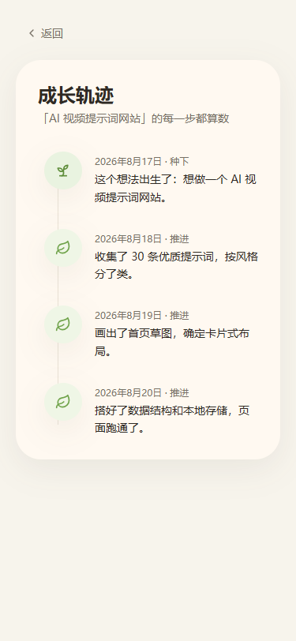
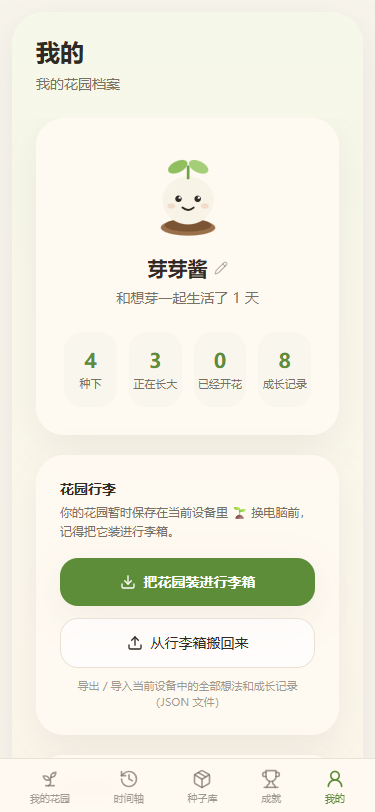

# 想芽 · 把想法慢慢养成真的

> 把脑子里的小念头，慢慢养成真的。

**想芽** 是一款把「想法」当种子一样养护的网页应用。记录下来，每天浇水、推进一点，看着它发芽、长叶、开花——直到那个想法真正变成现实。

## 线上访问

**https://jasonmarkppp.github.io/xiangya-site/**

---

## 项目截图

| 花园主页 | 记录想法 | 想法详情 |
|:---:|:---:|:---:|
|  |  |  |

| 成长时间线 | 完成时刻 | 我的花园 |
|:---:|:---:|:---:|
|  |  |  |

---

## 我为什么做想芽

很多想法并不是不够好，只是没被好好照顾。

过去的工具要么太重（项目管理、甘特图、看板），要么太轻（备忘录写进去就再也没翻开过）。想法在被认真对待之前，就已经悄悄死掉了。

所以我想做一个不一样的小工具：

- **把想法当生命** —— 每条想法是一颗种子，有自己的生长阶段，从种子到发芽、长叶、开花、结果，甚至休眠。
- **不逼你列计划，只让你每天做一点点** —— 每天记录一句进展（"今天为它做了什么"），不是 KPI，更像浇水。
- **看得见的时间** —— 花园和时间线把"坚持"变成看得见的风景，而不是表格里的数字。
- **安静、本地、属于你** —— 数据只存在你自己的设备上，不需要账号，不需要联网，像一盆真的花，种在自己家。

想芽不是效率工具，是一个陪你慢慢把想法养大的小花园。

---

## 核心功能

- 🌱 **种子库** —— 所有想法以「种子」形式收纳，标注阶段：种子 / 发芽 / 成长 / 开花 / 休眠
- 🏡 **花园** —— 把每个想法可视化成一株植物，看着它们一起生长
- 📅 **成长记录** —— 为每个想法记录每天的推进（浇水），形成专属时间线
- ⏳ **全局时间线** —— 跨越所有想法，看到自己一路坚持的轨迹
- 🏆 **成就系统** —— 连续浇水、种下第一颗种子等里程碑奖励
- 📦 **导出 / 导入** —— 全部数据可打包成 JSON 文件随身带走
- 🔒 **本地优先** —— 无账号、无联网，数据只存在当前设备

---

## 技术栈

- React + Vite + TypeScript
- Tailwind CSS
- React Router（HashRouter）
- Framer Motion 动效

## 本地运行

本仓库存放的是**构建后的静态产物**（`index.html` + `assets/`），可直接用任意静态服务器预览：

```bash
# 方式一：npx
npx serve .

# 方式二：Python
python -m http.server 8080
```

打开 http://localhost:8080 即可。

## 更新部署

源码在 `xiangya-web` 工程中，每次改完代码后：

1. `npm run build` 构建
2. 将 `dist/` 下的产物（`index.html`、`assets/`、`favicon.svg`）复制到本目录
3. 提交并推送：

```bash
git add .
git commit -m "update: ..."
git push
```

推送后 GitHub Pages 会自动重新部署（约 1 分钟）。

## License

[MIT](LICENSE)
